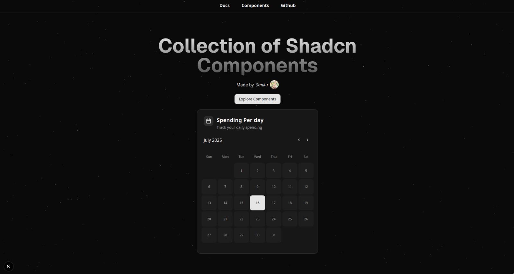

# Collection of shadcn components

## Documentation 
visit https://shadcn-collections.vercel.app/ for documentation

## Star History

## Contributors

Thanks to all our amazing contributors for their support and code!

